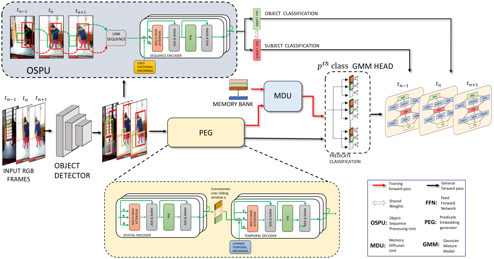

# FReMuRe: Frequency-Guided Multi-Level Reasoning for Scene Graph Generation in Video

Official PyTorch implementation of **"Frequency-Guided Multi-Level Reasoning for Scene Graph Generation in Video"**, accepted at **ICASSP 2026**.

<p align="center">
  
</p>

Video Scene Graph Generation (VidSGG) detects objects across video frames and predicts their pairwise relationships over time. Real-world relation annotations are heavily long-tailed — a handful of frequent predicates (e.g. "holding") dominate training data while informative rare predicates are underrepresented. FReMuRe builds on a spatial-temporal transformer backbone (in the spirit of [STTran](https://github.com/yrcong/STTran) and [TEMPURA](https://github.com/sayaknag/unbiasedSGG)) and adds frequency-aware components and probabilistic classification heads (Bayesian / GMM-based) aimed at improving performance on tail relations without sacrificing head-class accuracy.

## Installation

### Requirements
- Python >= 3.8
- PyTorch >= 1.10
- CUDA >= 11.0

### Setup

```bash
# Clone the repository
git clone https://github.com/lcx529955/FReMuRe.git
cd FReMuRe

# Create conda environment
conda create -n fremure python=3.8
conda activate fremure

# Install PyTorch (adjust CUDA version as needed)
pip install torch==1.12.1+cu113 torchvision==0.13.1+cu113 --extra-index-url https://download.pytorch.org/whl/cu113

# Install other dependencies
pip install -r requirements.txt

# Build the draw_rectangles module
cd lib/draw_rectangles
python setup.py build_ext --inplace
cd ../..

# Build fasterRCNN library
cd fasterRCNN/lib
python setup.py build develop
cd ../..
```

## Dataset Preparation

### Action Genome Dataset

1. Download the Action Genome dataset from the [official website](https://www.actiongenome.org/).

2. Download Charades videos and extract frames (follow instructions at [prior.allenai.org/projects/charades](https://prior.allenai.org/projects/charades)).

3. Organize the data structure:
```
datasets/ag/
├── frames/                    # Extracted video frames
├── annotations/
│   ├── object_classes.txt
│   ├── relationship_classes.txt
│   ├── person_bbox.pkl
│   └── object_bbox_and_relationship.pkl
```

4. Download pre-trained GloVe word vectors into `data/` (this repo does not ship them — they're large binary downloads):
```bash
wget http://nlp.stanford.edu/data/glove.6B.zip
unzip glove.6B.zip -d data/
```

5. Download a Faster R-CNN checkpoint trained for Action Genome object classes and place it at `fasterRCNN/models/faster_rcnn_ag.pth`.

## Usage

### Training

```bash
# Train with Bayesian head (PredCls mode)
python train.py -mode predcls \
    -data_path /path/to/datasets/ag/ \
    -rel_head bayesian \
    -freq True \
    -lr 1e-5 \
    -nepoch 10

# Train with GMM-Plus head (SGCls mode)
python train.py -mode sgcls \
    -data_path /path/to/datasets/ag/ \
    -rel_head gmm_plus \
    -K 6 \
    -freq True

# Train with SGDet mode
python train.py -mode sgdet \
    -data_path /path/to/datasets/ag/ \
    -rel_head bayesian \
    -freq True
```

### Key Arguments

| Argument | Description | Default |
|----------|-------------|---------|
| `-mode` | Task mode: `predcls`, `sgcls`, `sgdet` | `predcls` |
| `-data_path` | Path to Action Genome dataset | `YOUR_PATH_HERE/datasets/ag/` |
| `-model_path` | Path to a checkpoint for evaluation | `YOUR_PATH_HERE/models/best_Mrecall_model.tar` |
| `-obj_head` | Object classification head type | `linear` |
| `-rel_head` | Relation head type: `linear`, `bayesian`, `gmm_plus` | `bayesian` |
| `-freq` | Enable frequency-guided components | `True` |
| `-K` | Number of Gaussian mixture components | `6` |
| `-enc_layer` | Number of spatial encoder layers | `1` |
| `-dec_layer` | Number of temporal decoder layers | `3` |
| `-lr` | Learning rate | `1e-5` |
| `-nepoch` | Number of training epochs | `10` |
| `-tracking` | Enable object tracking | off |

Run `python train.py -h` / `python test.py -h` for the full argument list.

### Evaluation

```bash
python test.py -mode predcls \
    -data_path /path/to/datasets/ag/ \
    -model_path output/YOUR_MODEL_DIR/models/best_Mrecall_model.tar \
    -rel_head bayesian \
    -freq True
```

### Visualization

```bash
python test.py -mode predcls \
    -data_path /path/to/datasets/ag/ \
    -model_path output/YOUR_MODEL_DIR/models/best_Mrecall_model.tar \
    -vis \
    -vis_topk 5 \
    -vis_score_thresh 0.3
```

## Project Structure

```
FReMuRe/
├── train.py                    # Training script
├── test.py                     # Evaluation script
├── plot_relation_freq.py       # Relation frequency plotting utility
├── dataloader/
│   └── action_genome.py        # Action Genome dataset loader
├── lib/
│   ├── FReMuRe.py              # Main model architecture
│   ├── bayesian_heads.py       # Bayesian classification head
│   ├── BayesianHeadVMF.py      # Von Mises-Fisher Bayesian head variant
│   ├── gmm_heads.py            # GMM classification head
│   ├── gmm_heads_plus.py       # GMM-Plus classification head
│   ├── transformer.py          # Spatial-temporal transformer modules
│   ├── config.py               # Configuration / argument parser
│   ├── evaluation_recall.py    # Evaluation metrics
│   ├── object_detector.py      # Object detection wrapper
│   ├── word_vectors.py         # Word embedding utilities
│   └── ...
├── fasterRCNN/                  # Faster R-CNN implementation (vendored, own LICENSE)
│   ├── lib/                    # Core detection library
│   └── models/                 # Pre-trained weights (download separately)
└── data/                        # Word vectors (download separately)
```

## Citation

If you find this work useful, please cite:

```bibtex
@inproceedings{li2026frequency,
  title={Frequency-Guided Multi-Level Reasoning for Scene Graph Generation in Video},
  author={Li, Chenxing and Duan, Yiping and Tao, Xiaoming},
  booktitle={ICASSP 2026-2026 IEEE International Conference on Acoustics, Speech and Signal Processing (ICASSP)},
  pages={9162--9166},
  year={2026},
  organization={IEEE}
}
```

## Acknowledgements

This codebase builds upon several excellent works:
- [STTran](https://github.com/yrcong/STTran) — Spatial-Temporal Transformer for Video Scene Graph Generation
- [TEMPURA](https://github.com/sayaknag/unbiasedSGG) — Unbiased Scene Graph Generation in Videos (CVPR 2023)
- [faster-rcnn.pytorch](https://github.com/jwyang/faster-rcnn.pytorch) — PyTorch implementation of Faster R-CNN
- [Action Genome](https://www.actiongenome.org/) — Dataset for spatio-temporal scene graphs

## License

This project is released under the MIT License. See [LICENSE](LICENSE) for details. The vendored `fasterRCNN/` module carries its own license — see [fasterRCNN/LICENSE](fasterRCNN/LICENSE).

## Contact

For questions or issues, please open an issue on GitHub or contact lcxx24@mails.tsinghua.edu.cn.
